# Zippy Archon User Process Flow Diagram

## Overview

This document outlines the comprehensive user process flows for the Zippy Archon platform, covering both standard Archon V6 operations and enhanced agentic workflow capabilities.

## System Architecture

```
┌─────────────────┐    ┌─────────────────┐    ┌─────────────────┐
│   Frontend UI   │    │   Backend API   │    │   Database      │
│   (React/TS)    │◄──►│   (FastAPI)     │◄──►│   (Supabase)    │
│   Port: 3737    │    │   Port: 8181    │    │                 │
└─────────────────┘    └─────────────────┘    └─────────────────┘
         │                       │                       │
         ▼                       ▼                       ▼
┌─────────────────┐    ┌─────────────────┐    ┌─────────────────┐
│   MCP Server    │    │   AI Agents     │    │   Crawler       │
│   Port: 8051    │    │   Port: 8052    │    │   Service        │
└─────────────────┘    └─────────────────┘    └─────────────────┘
```

## Primary User Flows

### 1. Initial Setup & Onboarding Flow

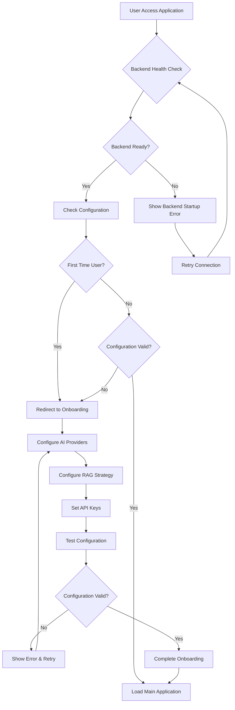

### 2. Knowledge Base Management Flow

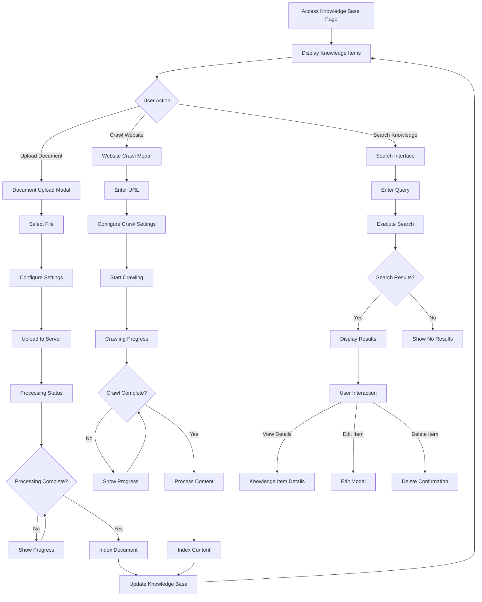

### 3. Project Management Flow

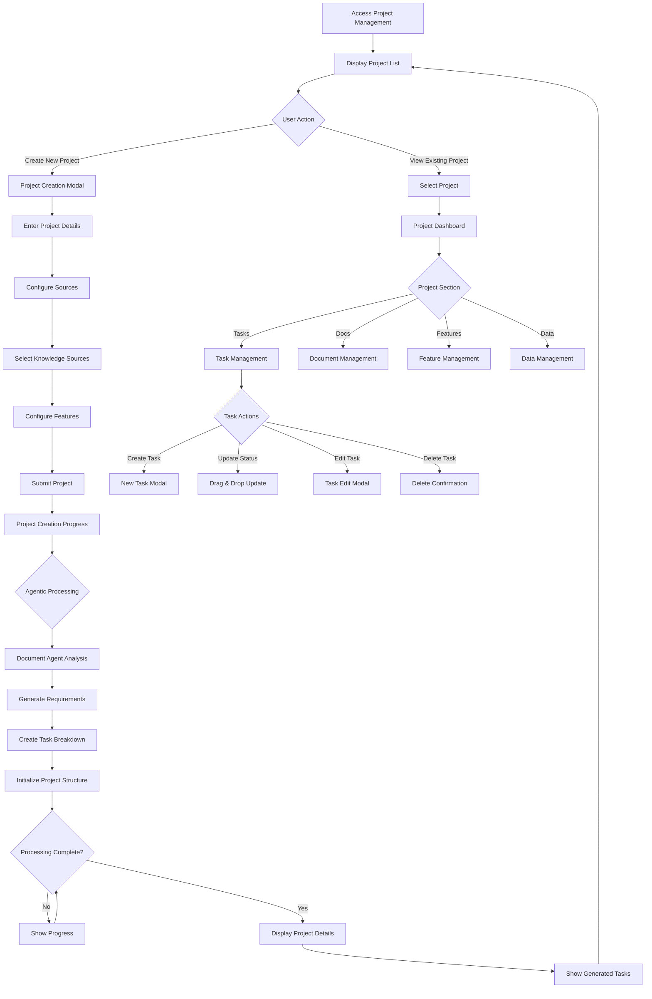

### 4. Settings & Configuration Flow

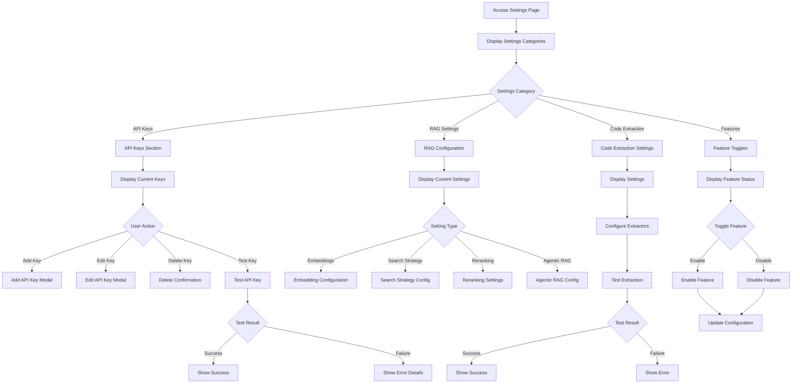

### 5. MCP Server Integration Flow

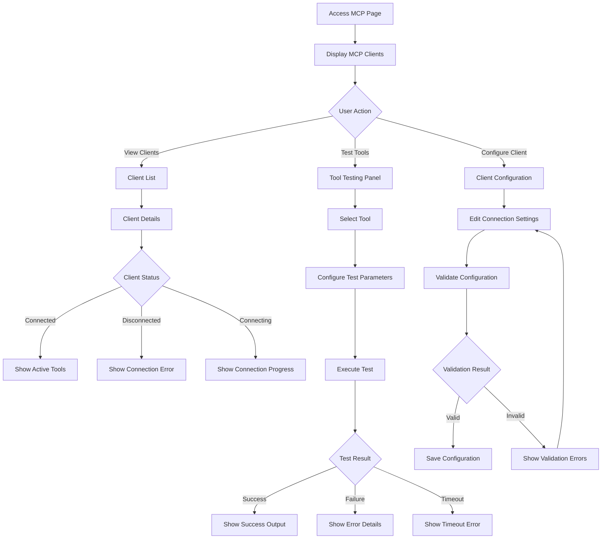

## Agentic Workflow Flows

### 6. Advanced Agentic Processing Flow

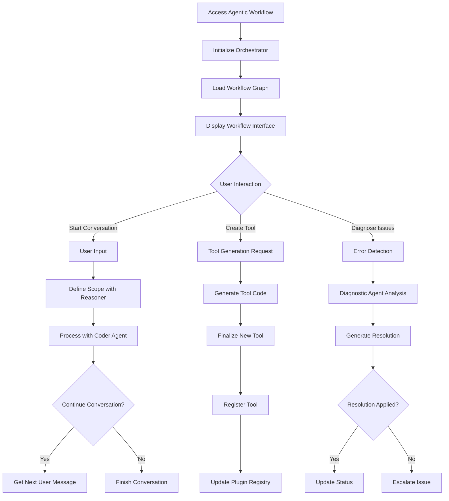

### 7. Plugin Management Flow

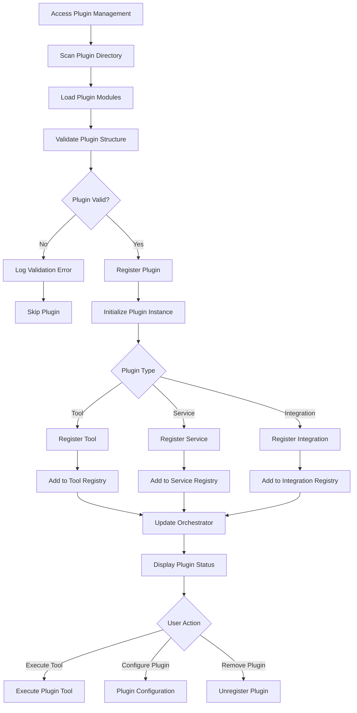

## Data Flow Patterns

### 8. Real-time Communication Flow

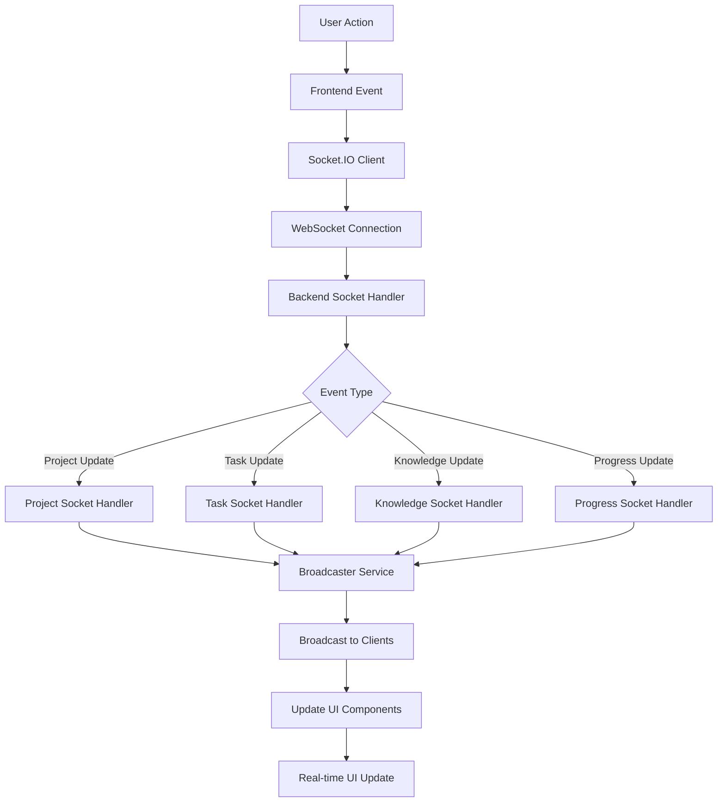

### 9. AI Processing Pipeline Flow

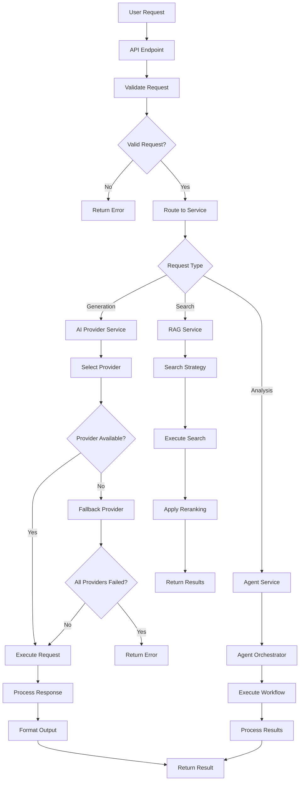

## Error Handling & Recovery Flows

### 10. Error Recovery Flow

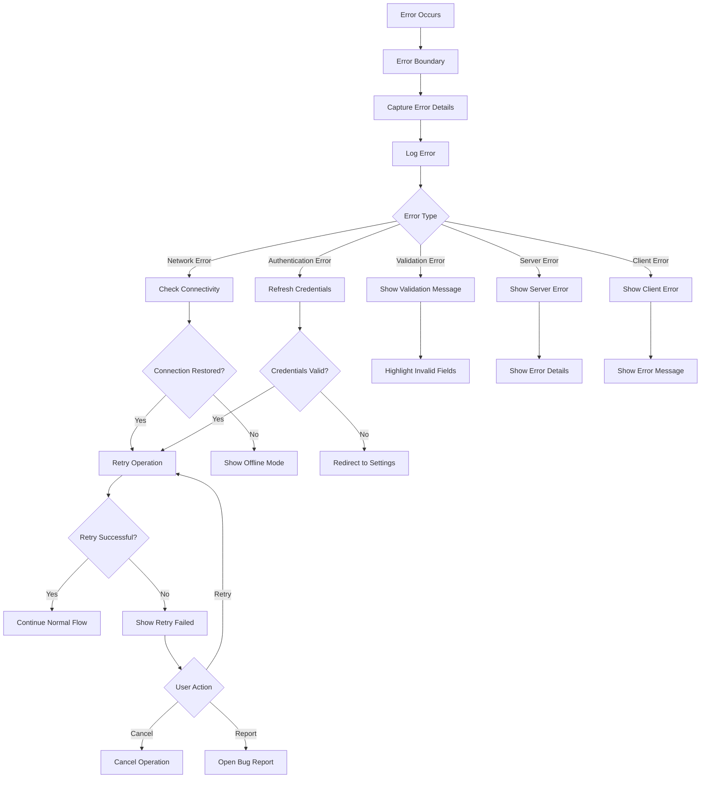

## Performance & Monitoring Flows

### 11. Health Monitoring Flow

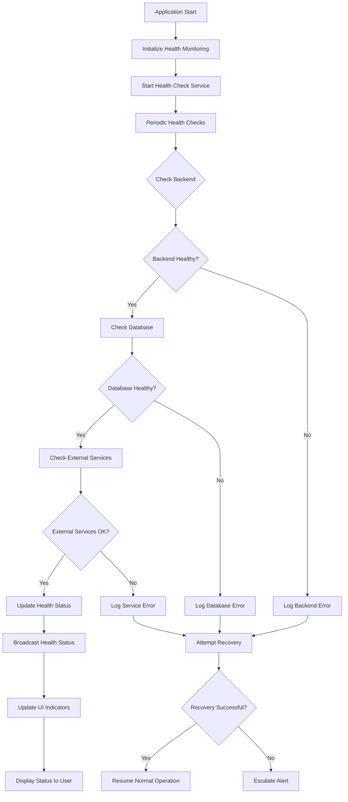

## Security & Authentication Flows

### 12. Authentication Flow

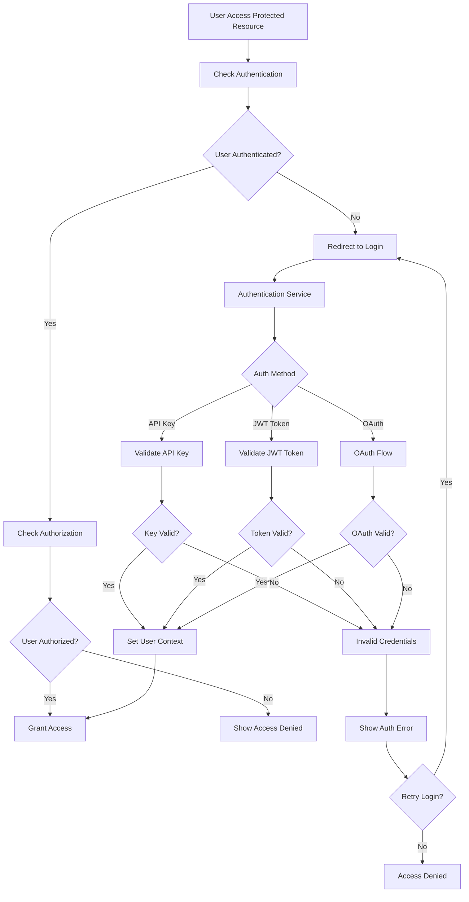

This comprehensive flow diagram covers all major user journeys and system interactions within the Zippy Archon platform, providing a clear roadmap for understanding the application's behavior and identifying areas for improvement.